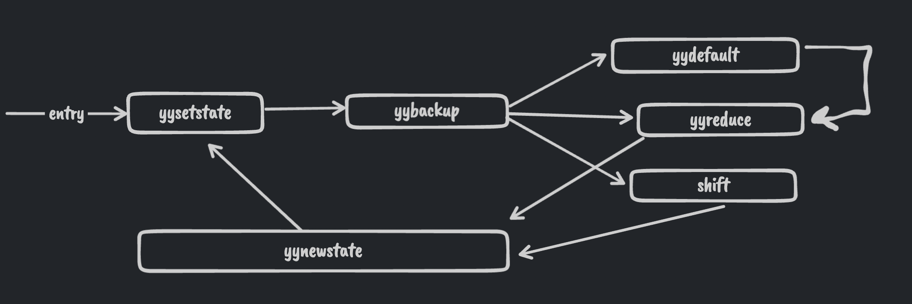

# cc
C compiler

The C language grammar (c.y and c.l files) have been taken from:

http://www.quut.com/c/ANSI-C-grammar-y-2011.html

---
# COL728
# Lab 1, Part 1

## Problem Statement

> [Part 1]: Study the generated lexer in file c.lex.cpp, and write a short report (1-5 pages) on the logic of the code produced through the lexical analyser generator. In particular, we are interested in the logic of the function represented by YY_DECL (representing the yylex() function). Keep your report as brief as possible, but do not miss out any interesting fact about the generated code or logic. Your report should reflect your understanding of the logic of the generated lexical analyzer.

## Background

For each token class in our language we define a _regular expression_ that matches all the strings for that token and an _action_ that is called when a token is found in the stream of input chars.

The flex tool reads the regular expressions in a `.l` file and creates a DFA which recognizes all the token classes.

This can be done by converting the `Regex` into `NFA` using `McNaughton–Yamada–Thompson algorithm` and then to a `DFA` using `subset construction algorithm`.

However in practice more advanced techniques like `Gerard Berry and Ravi Sethi algorithm` to convert `regex` directly into `DFA` is used.

Next, the number of DFA states maybe minimized using `Hopcroft's algorithm`.

The input character stream is run on the DFA until a `dead state`(A state from which no accepting state can be reached) is reached. Then we backtrack to find an accepting state.  
At this point we have found the _longest prefix_ of the input that matches with a token.

The longest prefix that is found may match to more than one regular expressions. In this case we output the token corresponding to the regex specified first in the file and call the specified action.

## Understanding the code

### DFA and actions

The code inside the label `yy_match` runs the DFA.

The array `yy_ec` maps each char to a character class.

Instead of storing a `2-D transition table`, the transition table is compressed and stored in a `1-D` array `yy_nxt`.  
To get the `NextState(state, char)` we index the array using `yy_base[state] + yy_ec[char]`, here `yy_base` points to the start of the transitions for a state in the `1-D table`. Note that many states have the same `yy_base[state]`.

Actions for accepting states are identified using ids, which are stored in `yy_accept`.  
If a state is non-accepting then `yy_accept[state] = 0`.

While running the `DFA` we may reach into some `accepting` states. We do not stop there and keep recording the `last_accepting_state` and `last_accepting_char_pos` as we move on. This is because we want to find the longest prefix that matches with a token.

The `DFA` is run until we reach the `base state = 699`.  
After we are out of the DFA loop (`yy_match`), we go into the `yy_find_action` label.

The `base state 699` seems to occur in 2 cases:

1. When we have reached a dead state in the DFA i.e. there is no possibility of the current prefix matching with any token. (For ex: a whitespace after "int" `int `).
2. When we have found an accepting state an there is no possibility of a longer prefix being an accepted state. For ex: when we are not inside a quotes and have found a semi-colon `;`.

In the Case[1], `yy_accept[current_state] = 0` and we "roll back" to the last found accepted state and get the corresponding action. In C language, most of the time this is just the previous character.

In Case[2], `yy_accept[current_state] != 0` (which means we are in an accepting state) and we directly get the action for the current state.

Finally we perform the action in `do_action` label using a `switch-case` block.

> The longest prefix that is found may match to more than one regular expressions. In this case we output the token corresponding to the regex specified first in the file and call the specified action.
>
> This is not checked at runtime in the code, instead the highest priority action is hard coded in the `DFA` and `yy_accept`.

### Buffering Logic

The input file is read into memory using double buffering. While running the DFA we might run out of buffer space, in this case we switch 
to the next buffer and the old buffer is filled with the next block of the input file.

---

# Lab1, Part 2

Understanding the parser file generated using bison/yacc.

## Background

- The yacc / bison parser generator produces an `LALR(1)` parser(Left to right, look ahead of 1, rightmost derivation) that uses a compressed action table built from canonical LR(1) automaton sets.
- The productions for the Grammar are specified in a `.y` file. For each production we can specify a semantic action using the symbols, for ex: to create a parse tree or to calculate the value of an expression.
- `LALR` parsers are shift reduce parsers which can not work with ambiguous grammars. However it is convenient to write ambiguous grammars. For this, yacc uses a default or user specified set of associativity and precedence rules to handle conflicts.
- The error handling method is using error productions which can be specified in the `.y` file by the user. 
- The parser that is generated reads tokens using a function `yylex()`. Lex is made to work with yacc and produces a `yylex()` function that can be used. 
- Yacc produces two files `c.tab.cpp` and `c.tab.hpp`. The `.hpp` file contains all the tokens and maps them to an integer value that is used by the parser. The `.cpp` file contains the parser code. 


## Understanding the code

The entry point for the parser is the `yyparse()` function.   
`yytable` is a compressed table that contains both the `goto(state, symbol)` and `action(state, lookahead)` values.   
We have two default tables `yydefact` and `yydefgoto` that are used to compress `yytable`. The default tables contain the most common action(reduction rule number or shift state number)/goto values of each state.


The `yyparse` function maintains the current state in the `yystate` variable and maintains two stacks, one for the states and one for the semantic values obtained by the user specified actions.  
The code starts by initializing the state and stack pointers and goes to the label `yysetstate`.  
In case of no errors, the flow of the code is as shown in the figure.   


The code breaks out of the flow loop when it reaches the termination state `YYFINAL`.  


The label `yynewstate` is called when we want to process a new state, it expects that the new state is set in the `yystate` variable. It just increments the top of the stack pointer and then goes to `yysetstate`.  


The label `yysetstate` first pushes the `yystate` to the top of the stack and increases the size of the stack if needed. It then jumps to the label `yybackup`.   


The label `yybackup` performs the shift reduce logic.  
It firsts checks what "class" does the current state belong to by referencing `yyn = yypact[yystate]`. If the current "class" suggests that a default reduction can be performed without any lookahead(`yyn == YYPACT_NINF`), then the code jumps to `yydefault` label. Otherwise it reads the lookahead using `yylex()`, if we didn't already have a lookahead. It then gets the action by indexing into `yytable` using `action(current_state, lookahead) = yytable[yypact[current_state] + lookahead_token_num]`.

The logic is shown in the code below with added comments. 
```c

  yyn += yytoken;   // yyn = yypact[yystate] + look_ahead_token_number, which is used to index into yytable

  // we check if the index is illegal(i.e. if we want to use the common default action)
  if (yyn < 0 || YYLAST < yyn || yycheck[yyn] != yytoken)   
    goto yydefault;                                          

  yyn = yytable[yyn]   // get the action
  if (yyn <= 0)
    {
      if (yyn == 0 || yyn == YYTABLE_NINF) goto yyerrlab;  // Handle error 
      yyn = -yyn;
      goto yyreduce;  // perform reduce action
    }

  if (yyn == YYFINAL)
    YYACCEPT;         // We got an accepting state action, YYACCEPT expands to goto acceptlab; 

    // Logic for SHIFT action below. 

    /* Count tokens shifted since error; after three, turn off error status.  */
    // yyerrstatus is set > 0 when we are in error recovery mode (i.e. we are looking to match an error production A -> error α)
    if (yyerrstatus)
        yyerrstatus--;

    /* Shift the look-ahead token.  */
    YY_SYMBOL_PRINT ("Shifting", yytoken, &yylval, &yylloc);

    /* Discard the shifted token unless it is eof.  */
    if (yychar != YYEOF)
        yychar = YYEMPTY;

    yystate = yyn;        // In this case yyn contained the shift state.  
    *++yyvsp = yylval;

    goto yynewstate;  // GOTO yynewstate after doing the shift. 
```   


The label `yydefault` just fetches the default action using the `yydefact` table and jumps to the label `yyreduce`.   


The label `yyreduce` performs the reduction logic. It expects the reduction rule number to be set in the variable `yyn`.   
It starts by getting the number of symbols(terminal / non-terminal) on the `RHS` of the reduction rule `yyn` using the table `yyr2` and then pops off that number of items from the state and semantic value stack.  
Next, it sets the semantic value using the value on top of the stack and the reduction rule. No semantic actions are specified in the grammar so the default rule `$$ = $1` is used.   
Finally it gets the next state using the goto table. `STATE = GOTO(TOP_OF_STACK, LHS symbol of reduction rule)` and then jumps to the label `yynewstate`. 
The code below contains the logic for this with added comments. 

```c
  // The goto transitions are flattened and stored in the compressed yytable. 
  // We get the next state using 
  // next_state = yytable[yypgoto[lhs_symbol_num] + top_of_stack_state]
  //                        ^^ base index in yy_table      ^^ displacement

  // yyn contained the reduction rule number.
  // yyn is set to the symbol number of the LHS of the rule
  yyn = yyr1[yyn];

  // we subtract YYNTOKENS(number of terminals) from yyn as the yypgoto table only contains transitions for non terminals. 
  // first we get an intermediate index into yytable based on lhs of rule and top of stack
  yystate = yypgoto[yyn - YYNTOKENS] + *yyssp; 

  // we check if the index is legal(i.e. if we dont want to use the common default action)
  if (0 <= yystate && yystate <= YYLAST && yycheck[yystate] == *yyssp)
    yystate = yytable[yystate];   // legal index, use yytable
  else
    yystate = yydefgoto[yyn - YYNTOKENS];  // illegal index, use default value

  goto yynewstate;  // pushes the new state in the stack and starts performs the action for it.

```

### Error handling

The code contains error handling logic at many points which can be summed up as follows:

If the entry in the LALR table is empty(i.e. we cant move forward and there is an error), we start popping the stack until the top of the stack is a state which contains an error production item of the form `A -> .error α`. It then pushes the `error` symbol on the stack and keeps reading the input until it matches `α`. At this point it has recovered from the error and uses the reduction `A -> .error α`.    
After an error recovery the parser calls a user defined error handling function.   
```c
#line 539 "c.y"

#include <stdio.h>

void yyerror(const char *s)
{
	fflush(stdout);
	fprintf(stderr, "*** %s\n", s);
}
```


### References 

Compilers: Principles, Techniques and Tools, Section 4.9