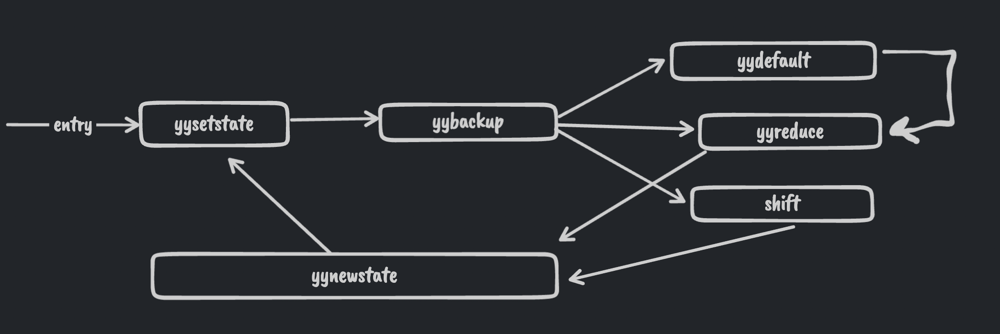

# Lab1, Part 2

Understanding the parser file generated using bison/yacc.

## Background

- The yacc / bison parser generator produces an `LALR(1)` parser(Left to right, look ahead of 1, rightmost derivation) that uses a compressed action table built from canonical LR(1) automaton sets.
- The productions for the Grammar are specified in a `.y` file. For each production we can specify a semantic action using the symbols, for ex: to create a parse tree or to calculate the value of an expression.
- `LALR` parsers are shift reduce parsers which can not work with ambiguous grammars. However it is convenient to write ambiguous grammars. For this, yacc uses a default or user specified set of associativity and precedence rules to handle conflicts.
- The error handling method is using error productions which can be specified in the `.y` file by the user. 
- The parser that is generated reads tokens using a function `yylex()`. Lex is made to work with yacc and produces a `yylex()` function that can be used. 
- Yacc produces two files `c.tab.cpp` and `c.tab.hpp`. The `.hpp` file contains all the tokens and maps them to an integer value that is used by the parser. The `.cpp` file contains the parser code. 


## Understanding the code

The entry point for the parser is the `yyparse()` function.   
`yytable` is a compressed table that contains both the `goto(state, symbol)` and `action(state, lookahead)` values.   
We have two default tables `yydefact` and `yydefgoto` that are used to compress `yytable`. The default tables contain the most common action(reduction rule number or shift state number)/goto values of each state.


The `yyparse` function maintains the current state in the `yystate` variable and maintains two stacks, one for the states and one for the semantic values obtained by the user specified actions.  
The code starts by initializing the state and stack pointers and goes to the label `yysetstate`.  
In case of no errors, the flow of the code is as shown in the figure.   


The code breaks out of the flow loop when it reaches the termination state `YYFINAL`.  


The label `yynewstate` is called when we want to process a new state, it expects that the new state is set in the `yystate` variable. It just increments the top of the stack pointer and then goes to `yysetstate`.  


The label `yysetstate` first pushes the `yystate` to the top of the stack and increases the size of the stack if needed. It then jumps to the label `yybackup`.   


The label `yybackup` performs the shift reduce logic.  
It firsts checks what "class" does the current state belong to by referencing `yyn = yypact[yystate]`. If the current "class" suggests that a default reduction can be performed without any lookahead(`yyn == YYPACT_NINF`), then the code jumps to `yydefault` label. Otherwise it reads the lookahead using `yylex()`, if we didn't already have a lookahead. It then gets the action by indexing into `yytable` using `action(current_state, lookahead) = yytable[yypact[current_state] + lookahead_token_num]`.

The logic is shown in the code below with added comments. 
```c

  yyn += yytoken;   // yyn = yypact[yystate] + look_ahead_token_number, which is used to index into yytable

  // we check if the index is illegal(i.e. if we want to use the common default action)
  if (yyn < 0 || YYLAST < yyn || yycheck[yyn] != yytoken)   
    goto yydefault;                                          

  yyn = yytable[yyn]   // get the action
  if (yyn <= 0)
    {
      if (yyn == 0 || yyn == YYTABLE_NINF) goto yyerrlab;  // Handle error 
      yyn = -yyn;
      goto yyreduce;  // perform reduce action
    }

  if (yyn == YYFINAL)
    YYACCEPT;         // We got an accepting state action, YYACCEPT expands to goto acceptlab; 

    // Logic for SHIFT action below. 

    /* Count tokens shifted since error; after three, turn off error status.  */
    // yyerrstatus is set > 0 when we are in error recovery mode (i.e. we are looking to match an error production A -> error α)
    if (yyerrstatus)
        yyerrstatus--;

    /* Shift the look-ahead token.  */
    YY_SYMBOL_PRINT ("Shifting", yytoken, &yylval, &yylloc);

    /* Discard the shifted token unless it is eof.  */
    if (yychar != YYEOF)
        yychar = YYEMPTY;

    yystate = yyn;        // In this case yyn contained the shift state.  
    *++yyvsp = yylval;

    goto yynewstate;  // GOTO yynewstate after doing the shift. 
```   


The label `yydefault` just fetches the default action using the `yydefact` table and jumps to the label `yyreduce`.   


The label `yyreduce` performs the reduction logic. It expects the reduction rule number to be set in the variable `yyn`.   
It starts by getting the number of symbols(terminal / non-terminal) on the `RHS` of the reduction rule `yyn` using the table `yyr2` and then pops off that number of items from the state and semantic value stack.  
Next, it sets the semantic value using the value on top of the stack and the reduction rule. No semantic actions are specified in the grammar so the default rule `$$ = $1` is used.   
Finally it gets the next state using the goto table. `STATE = GOTO(TOP_OF_STACK, LHS symbol of reduction rule)` and then jumps to the label `yynewstate`. 
The code below contains the logic for this with added comments. 

```c
  // The goto transitions are flattened and stored in the compressed yytable. 
  // We get the next state using 
  // next_state = yytable[yypgoto[lhs_symbol_num] + top_of_stack_state]
  //                        ^^ base index in yy_table      ^^ displacement

  // yyn contained the reduction rule number.
  // yyn is set to the symbol number of the LHS of the rule
  yyn = yyr1[yyn];

  // we subtract YYNTOKENS(number of terminals) from yyn as the yypgoto table only contains transitions for non terminals. 
  // first we get an intermediate index into yytable based on lhs of rule and top of stack
  yystate = yypgoto[yyn - YYNTOKENS] + *yyssp; 

  // we check if the index is legal(i.e. if we dont want to use the common default action)
  if (0 <= yystate && yystate <= YYLAST && yycheck[yystate] == *yyssp)
    yystate = yytable[yystate];   // legal index, use yytable
  else
    yystate = yydefgoto[yyn - YYNTOKENS];  // illegal index, use default value

  goto yynewstate;  // pushes the new state in the stack and starts performs the action for it.

```

### Error handling

The code contains error handling logic at many points which can be summed up as follows:

If the entry in the LALR table is empty(i.e. we cant move forward and there is an error), we start popping the stack until the top of the stack is a state which contains an error production item of the form `A -> .error α`. It then pushes the `error` symbol on the stack and keeps reading the input until it matches `α`. At this point it has recovered from the error and uses the reduction `A -> .error α`.    
After an error recovery the parser calls a user defined error handling function.   
```c
#line 539 "c.y"

#include <stdio.h>

void yyerror(const char *s)
{
	fflush(stdout);
	fprintf(stderr, "*** %s\n", s);
}
```


### References 

Compilers: Principles, Techniques and Tools, Section 4.9